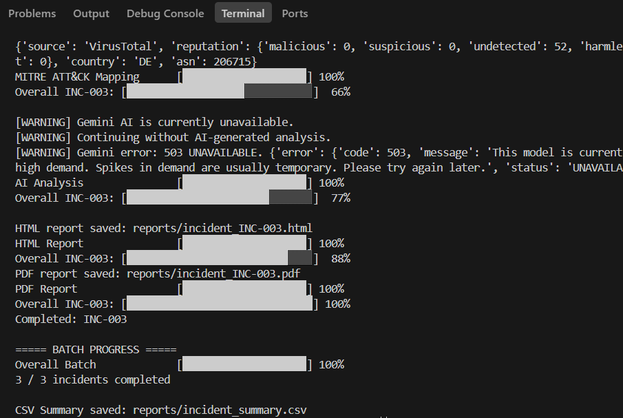
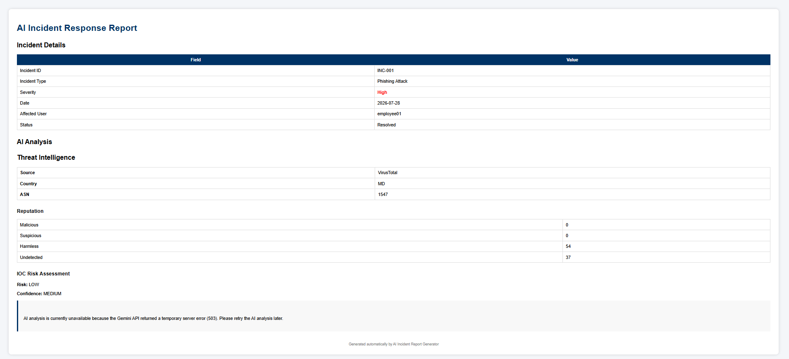
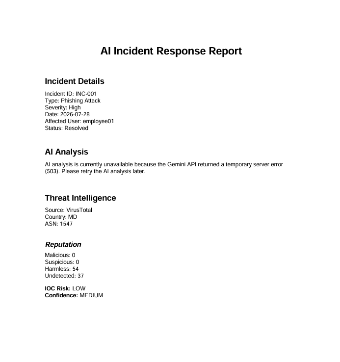
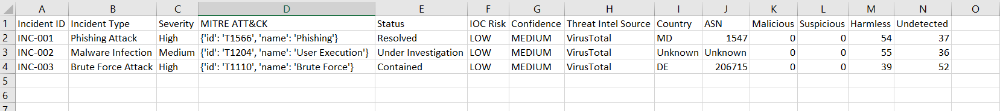

# AI Incident Report Generator

An automated cybersecurity incident analysis and reporting tool designed to assist SOC analysts with incident processing, IOC extraction, threat intelligence enrichment, MITRE ATT&CK mapping, reputation analysis, and professional report generation.

## Overview

The AI Incident Report Generator processes structured cybersecurity incident data and produces detailed incident reports in HTML and PDF formats.

The system combines traditional security analysis with external threat intelligence and AI-assisted reporting.

### Workflow

Incident JSON
    |
    v
Incident Parsing
    |
    v
Incident Analysis
    |
    v
IOC Extraction
    |
    v
VirusTotal Threat Intelligence
    |
    v
IOC Reputation Analysis
    |
    v
MITRE ATT&CK Mapping
    |
    v
AI-Assisted Report Generation
    |
    v
HTML / PDF Reports
    |
    v
CSV Incident Summary

## Key Features

- Automated incident JSON parsing
- IOC extraction
- VirusTotal threat intelligence enrichment
- IOC reputation scoring
- MITRE ATT&CK technique mapping
- AI-assisted SOC incident reporting
- Graceful handling of Gemini API unavailability
- HTML report generation
- PDF report generation
- CSV incident summary
- Per-incident progress tracking
- Batch processing progress tracking
- Application logging
- Environment-based API key management

## Cybersecurity Capabilities

The project demonstrates practical SOC and incident-response concepts including:

- Indicator of Compromise (IOC) analysis
- Threat intelligence enrichment
- IOC reputation assessment
- MITRE ATT&CK mapping
- Incident severity analysis
- Containment recommendations
- Remediation recommendations
- Risk assessment
- Automated security reporting

## Technologies Used

- Python
- Google Gemini API
- VirusTotal API
- MITRE ATT&CK
- ReportLab
- HTML/CSS
- CSV
- Python logging
- python-dotenv

## Project Structure

```text
AI-Incident-Report-Generator/
|
+-- app/
|   +-- ai_engine.py
|   +-- analyzer.py
|   +-- config.py
|   +-- csv_report.py
|   +-- dashboard.py
|   +-- dashboard_generator.py
|   +-- file_loader.py
|   +-- ioc.py
|   +-- logger.py
|   +-- main.py
|   +-- mitre.py
|   +-- mitre_mapper.py
|   +-- parser.py
|   +-- pdf_generator.py
|   +-- progress.py
|   +-- report_generator.py
|   +-- reputation.py
|   +-- risk_score.py
|   +-- threat_intel.py
|
+-- data/
|   +-- incident1.json
|   +-- incident2.json
|   +-- incident3.json
|
+-- templates/
|   +-- dashboard_template.html
|   +-- report_template.html
|
+-- requirements.txt
+-- README.md
+-- .gitignore
 
 
## Screenshots

### Terminal Execution



### HTML Incident Report



### PDF Incident Report



### CSV Incident Summary

